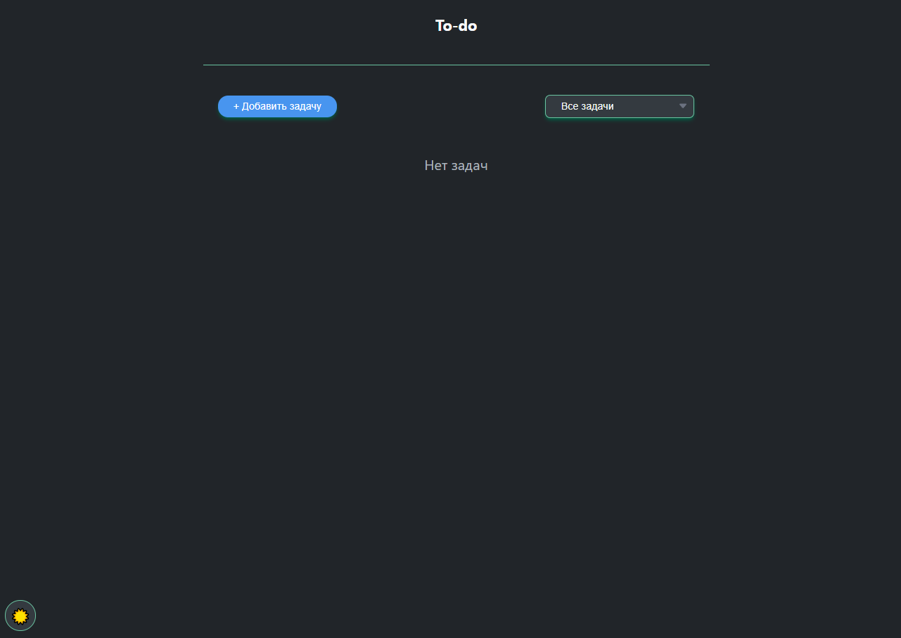
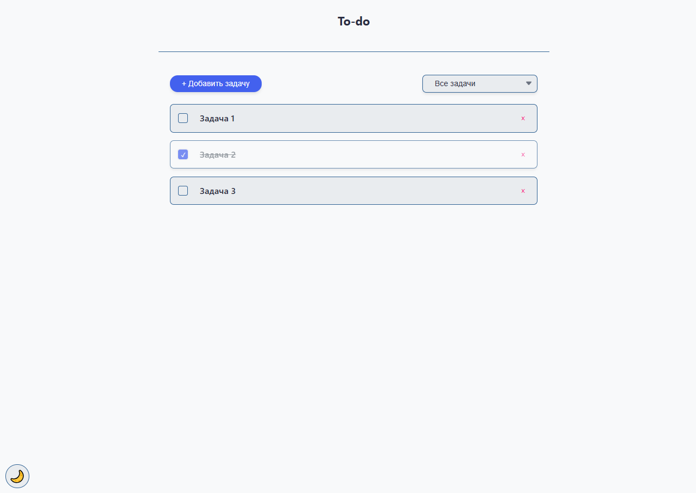
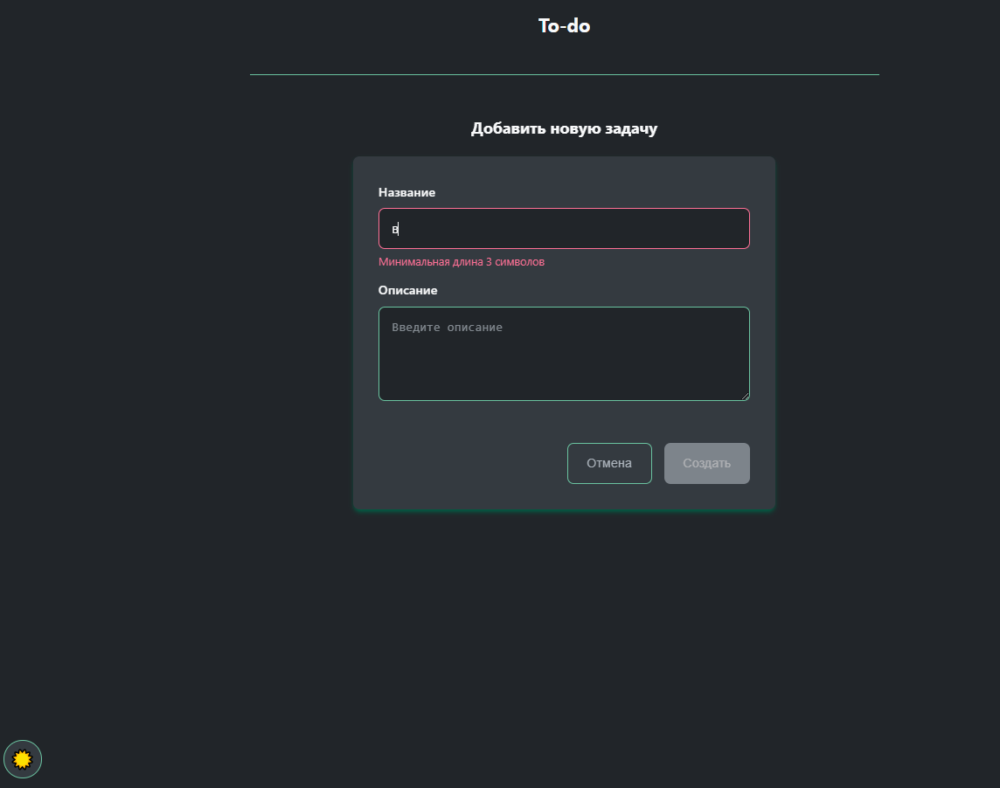

# 📝 To-Do App

Простое и удобное приложение для управления задачами с поддержкой темной/светлой темы и сохранением состояния.

## ✨ Основные функции

- 🖊️ Добавление задач с названием и описанием
- ✅ Отметка выполненных задач (чекбоксы)
- 🗑️ Удаление задач
- 🔍 Фильтрация: Все/Активные/Выполненные
- 🌗 Переключение тем (светлая/тёмная)
- 💾 Автосохранение в localStorage
- 📱 Полностью адаптивный интерфейс

## 🛠️ Технологии

- Angular 17+
- **Signals** для реактивного состояния
- SCSS с CSS-переменными
- Angular Router
- Standalone Components API

## 🚀 Установка и запуск

1. Клонируйте репозиторий:
```bash
git clone https://github.com/tyskanhik/todo-angular.git
cd todo-angular
```

2. Установите зависимости:
```bash
npm install
```

3. Запустите приложение:
```bash
ng serve
```

4. Откройте в браузере:
```text
http://localhost:4200
```

## 📂 Структура проекта

```text
src/
├── app/
│   ├── core/
│   │   ├── services/       # Сервисы (TaskService, ThemeService)
│   │   ├── models/         # Интерфейсы (Task)
│ 	│ 	└── utils/          # Утилиты (StorageUtil)
│   ├── features/
│   │   ├── task-list/      # Страница списка задач
│   │   ├── add-task/       # Страница добавления
│   │   └── edit-task/      # Страница редактирования
│   └── shared/
│       └── components/     # Общие компоненты
├── styles/
│   ├── _variables.scss     # SCSS-переменные
│   └── _themes.scss        # Стили тем
```

## Особенности реализации

1. **Система тем**:
   - Сохранение выбранной темы в localStorage
   - Плавные переходы между темами

2. **Работа с задачами**:
   - Редактирование существующих задач
   - Подробный просмотр с описанием
   - Фильтрация по статусу выполнения

3. **UI**:
   - Адаптивный дизайн
   - Интуитивная навигация

## Скриншоты



